<p align="center">
  
</p>

<p align="center">
  <b>Student • Builder • Experimenter</b><br/>
  <sub>Turning what I learn into things I can actually ship.</sub>
</p>

<p align="center">
  
  
  
  
</p>

---

## ◈ IDENTITY CORE

I'm **Mohammed Hasnain**, a **B.Tech CSE (AI/ML) student** focused on learning by building.

My current path sits at the intersection of:

- 🤖 Artificial Intelligence & Machine Learning
- 🧠 Agentic AI and AI-powered applications
- 🌐 Web development
- 🐍 Python and programming fundamentals
- ⚡ Hackathons, experiments and real-world problem solving
- 🛠️ Git, GitHub and collaborative development

I don't want this profile to be a collection of random tutorial repositories.

**Learn → Build → Document → Improve → Ship.**

---

## ◈ CURRENT OPERATIONS

| System | Status |
|---|---|
| CSE AI/ML | 🟢 ACTIVE |
| Web Development | 🟢 ACTIVE |
| Agentic AI | 🟢 EXPLORING |
| Hackathons | 🟢 ACTIVE |
| Git & GitHub | 🟢 BUILDING |
| Hasnain.OS | 🟡 IN DEVELOPMENT |
| Easy Ride | 🔒 FUTURE BUILD |

---

## ◈ PROJECT MATRIX

### 🤖 AI & Agentic AI

**[CareerGuide-AI](https://github.com/hasnain1522/CareerGuide-AI)**  
An AI-powered career and exploration project built while learning agentic systems, APIs and modern AI application architecture.

**[AI-Career-Agent](https://github.com/hasnain1522/AI-Career-Agent)**  
An AI career-focused project from my Agentic AI learning journey.

### 🌐 Web & Programming

**[Simple-Bank-Chatbot](https://github.com/hasnain1522/Simple-Bank-Chatbot)**  
An early Python project exploring conversational interaction and banking-style workflows.

**[Way Down We Go — HTML Practice](https://github.com/hasnain1522/-Way-Down-We-Go-HTML-Practice-Project)**  
An early web project created to practice HTML structure and fundamentals.

### 🧪 Hackathons

**[IBM BOB 2 Hackathon](https://github.com/hasnain1522/IBM-BOB-2-HACKATHON)**  
Current hackathon workspace for experimenting, building and documenting the journey.

---

## ◈ TECH CORE

<p align="center">
  
</p>

> My stack is a work in progress. I prefer showing what I'm genuinely learning and building rather than collecting logos.

---

## ◈ LEARNING ENGINE

Currently going deeper into:

**AI/ML → Agentic AI → Web Applications → APIs → Databases → Real-world AI Products**

I'm especially interested in how AI can move beyond simple chat interfaces and become useful systems that can **reason, use tools, retrieve information and complete tasks.**

---

## ◈ BUILD PROTOCOL

```text
LEARN
  ↓
EXPERIMENT
  ↓
BUILD
  ↓
BREAK
  ↓
DEBUG
  ↓
DOCUMENT
  ↓
SHIP
  ↓
REPEAT
```

No fake "10x" mythology.

Just consistent improvement and increasingly better things shipped.

---

## ◈ GITHUB TELEMETRY

<p align="center">
  
  
</p>

---

## ◈ CONNECT

<p align="center">
  <a href="https://github.com/hasnain1522">GitHub</a>
  &nbsp;•&nbsp;
  <a href="https://www.linkedin.com/">LinkedIn</a>
</p>

<p align="center">
  <sub>HASNAIN.OS // IDENTITY CORE ONLINE</sub>
</p>
