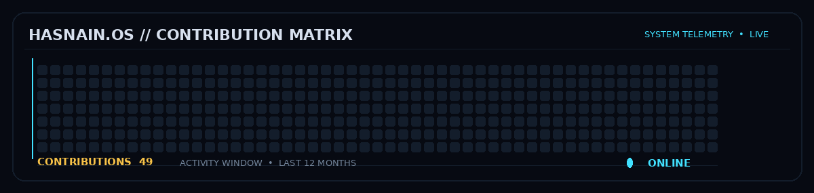

  

<b>CSE AI/ML Student</b> &nbsp;•&nbsp; <b>Agentic AI Builder</b> &nbsp;•&nbsp; <b>Web Developer</b>

<i>AI • Web • Agentic Systems • Hackathons • Building in Public</i>

<a href="https://github.com/hasnain1522">GitHub</a> &nbsp;•&nbsp; <a href="https://www.linkedin.com/in/mohammed-hasnain78931522/">LinkedIn</a> &nbsp;•&nbsp; <a href="https://hasnainos.onrender.com">Portfolio</a>

---

## ◈ IDENTITY CORE
I'm **Mohammed Hasnain**, a **B.Tech CSE (AI/ML) student** building my skills by turning ideas into working software.

My current engineering path sits at the intersection of:
- 🤖 Artificial Intelligence & Machine Learning
- 🧠 Agentic AI and multi-agent applications
- 🌐 Web development and interactive products
- 🐍 Python and backend engineering
- 🗄️ APIs, databases and application architecture
- ⚡ Hackathons and rapid product development
- 🛠️ Git, GitHub and collaborative workflows

> **Learn → Build → Break → Debug → Document → Ship → Repeat**

I do not want this profile to be a list of technologies I have touched. I want it to show what I have actually built and what I am learning next.

---

## ◈ CURRENT OPERATIONS

| Area | Status | Focus |
|---|---|---|
| CSE AI/ML | 🟢 ACTIVE | Core academic + practical learning |
| Web Development | 🟢 ACTIVE | React, frontend systems, APIs |
| Agentic AI | 🟢 EXPLORING | Agents, tools, research, AI products |
| Hackathons | 🟢 ACTIVE | Building under real constraints |
| Git & GitHub | 🟢 BUILDING | Collaboration, version control, CI |
| Hasnain.OS | 🟡 IN DEVELOPMENT | Personal portfolio / command center |
| Easy Ride | 🔒 FUTURE BUILD | Mobility + delivery product concept |

---

## ◈ FLAGSHIP PROJECTS

### ◆ DevForge — Agentic Engineering Control Center

**Analyze → Mission → Execute → Verify → Measure → Deliver → Prove**

An engineering prototype exploring how AI coding workflows can move beyond generation into measurable engineering execution. It analyzes repositories, creates engineering missions, executes scoped work, verifies changes, preserves evidence and generates impact information.

**Built for:** IBM Bob 2.0 Hackathon  
**Status:** 🟡 Hackathon MVP / Engineering Prototype

→ [View DevForge](https://github.com/hasnain1522/DevForge)

### ◆ CareerGuide AI — AI Guidance Platform

An AI application exploring career, job and business guidance through specialist agents, research, personalization and guardrails.

> **AI should support a person’s decision-making process, not make the decision for them.**

**Status:** 🟢 Active AI/ML Project

→ [View CareerGuide AI](https://github.com/hasnain1522/CareerGuide-AI)

### ◆ RFPulse — RFP Intelligence

An AI-powered RFP workflow exploring how proposal systems can learn from previous wins and losses.

**Read RFP → Recall Experience → Recommend → Draft → Record Outcome → Learn**

**Status:** 🟢 AI Engineering MVP

→ [View RFPulse](https://github.com/hasnain1522/RFPulse)

### ◆ StockSense — Inventory Management

An inventory-management application developed for the **Odoo × GCET Hyderabad Hackathon 2026**. It covers products, warehouses, locations, receipts, deliveries, transfers, adjustments, movement history and dashboard metrics.

**Virtual round:** Completed  
**Result:** Awaiting / verify through official event announcement

→ [View StockSense](https://github.com/hasnain1522/stocksense)

### ◆ Hasnain.OS — Personal Command Center

My personal portfolio is being developed as an interactive operating-system-style experience instead of a conventional static portfolio.

**Boot → Identity → Command Center → Projects → Tech Core → AI Lab → Future Builds**

**Status:** 🟡 In Development

→ [View Hasnain.OS](https://github.com/hasnain1522/HasnainOS)

---

## ◈ PROJECT MATRIX

### 🤖 AI & Agentic AI
- [CareerGuide-AI](https://github.com/hasnain1522/CareerGuide-AI) — AI career, job and business guidance.
- [AI-Career-Agent](https://github.com/hasnain1522/AI-Career-Agent) — multi-agent AI engineering exploration.
- [RFPulse](https://github.com/hasnain1522/RFPulse) — RFP intelligence and outcome memory.
- [DevForge](https://github.com/hasnain1522/DevForge) — agentic engineering control center.

### 🌐 Web & Product Engineering
- [Hasnain.OS](https://github.com/hasnain1522/HasnainOS) — interactive personal portfolio.
- [StockSense](https://github.com/hasnain1522/stocksense) — inventory management application.
- [Easy Ride](https://github.com/hasnain1522/EasyRide) — future mobility + delivery platform concept.
- [Way Down We Go](https://github.com/hasnain1522/-Way-Down-We-Go-HTML-Practice-Project) — early HTML practice project.

### 🐍 Python Foundations
- [Simple Bank Chatbot](https://github.com/hasnain1522/Simple-Bank-Chatbot) — early rule-based Python project built to practice programming fundamentals.

---

## ◈ HACKATHON OPERATIONS

Hackathons are one of my main ways of learning because they force an idea through the full loop: **Problem → Architecture → Build → Debug → Demo → Documentation**.

### IBM Bob 2.0
**DevForge** — agentic engineering control center prototype.

The final end-to-end live provider path was not fully validated, so I documented the limitation instead of presenting an unverified demo as complete.

### Odoo × GCET Hyderabad Hackathon 2026
**StockSense** — inventory management system.

The virtual round was completed. Final result was pending at the time of this profile update.

### Devnovate — Hack With Hyderabad 3.0
**Status:** 🟢 Active hackathon track

Working with a team on a real-world problem-solving build and preparing for the final-stage event.

---

## ◈ TECH CORE

These represent technologies I am learning, actively using, or have used in projects. The list is intentionally not a claim of mastery.

---

## ◈ ENGINEERING INTERESTS

    Artificial Intelligence
            ↓
       Agentic AI
            ↓
 Agents + Tools + Research + Memory
            ↓
 APIs + Databases + Web Applications
            ↓
       Useful AI Products

I am particularly interested in systems where AI can use tools, retrieve relevant information, operate through bounded tasks, verify its work, preserve evidence and interact with real software systems.

---

## ◈ BUILD PHILOSOPHY

    IDEA
      ↓
   RESEARCH
      ↓
  PROTOTYPE
      ↓
   BREAK IT
      ↓
   DEBUG IT
      ↓
   VERIFY IT
      ↓
 DOCUMENT IT
      ↓
    SHIP IT
      ↓
LEARN FROM IT

I value **working software, honest documentation and measurable progress** more than simply collecting certificates or technology names.

A failed experiment is still useful if I can explain: **what I tried → what broke → why it broke → what I learned → what I changed.**

---

## ◈ LEARNING ENGINE

**Current direction:** `CSE AI/ML → Agentic AI → Web Applications → APIs → Databases → AI Products → Product Engineering`

My goal is to gradually move from learning individual technologies to designing complete systems.

---

## ◈ HASNAIN.OS TELEMETRY

Telemetry is generated automatically by GitHub Actions and stored in this repository. The contribution matrix uses real GitHub contribution data with a custom Hasnain.OS presentation.

---

## ◈ ROADMAP

    NOW
    ├── CSE AI/ML
    ├── Agentic AI
    ├── Web Development
    ├── Hackathons
    └── Hasnain.OS

    NEXT
    ├── Stronger AI applications
    ├── Better full-stack engineering
    ├── More real-world deployments
    ├── Open-source collaboration
    └── Deeper system design

    FUTURE
    ├── Easy Ride
    ├── AI-powered products
    ├── Startup experiments
    └── Building systems people actually use

---

## ◈ CONNECT

<a href="https://github.com/hasnain1522">GitHub</a> &nbsp;•&nbsp; <a href="https://www.linkedin.com/in/mohammed-hasnain78931522/">LinkedIn</a> &nbsp;•&nbsp; <a href="https://hasnainos.onrender.com">Portfolio</a>

HASNAIN.OS // IDENTITY CORE ONLINE // BUILDING IN PUBLIC
